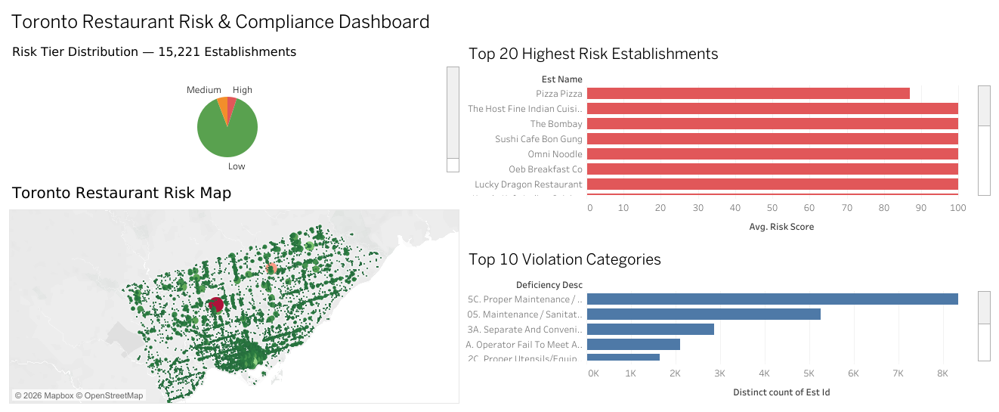

# Toronto Restaurant Risk & Compliance Analytics

A flagship end-to-end Data & Business Analyst portfolio project
built on real City of Toronto open data — 102,766 DineSafe
inspection records across 15,221 active food establishments.

## Live Dashboard
🔗 [Toronto Restaurant Risk & Compliance Dashboard](https://public.tableau.com/views/TorontoRestaurantRiskComplianceDashboard/DineSafeDashboard)

---

## Project Overview
Acting as a Data & Business Analyst for the City of Toronto
Public Health Division, this project delivers a complete
compliance intelligence system — from raw government data
to an interactive risk dashboard and actionable business
recommendations.

**The central question:**
> *"Which Toronto restaurants are most likely to cause a
> public health incident — and what should the city do about it?"*

---

## Key Findings

### 1. Overall compliance rate: 83.7%
85,984 of 102,766 inspections resulted in a Pass outcome.
443 establishments received closure orders during the analysis
period (November 2023 – June 2026).

**Implication:** While the majority of Toronto restaurants meet
food safety standards, 16.3% of inspections reveal active
compliance gaps requiring intervention.

### 2. Repeat offender rate: 22.3% — far above target
3,400 of 15,221 active establishments recorded 3 or more
violations in a 12-month window. The highest repeat offender —
**Kasa Moto (115 Yorkville Ave)** — recorded 35 violations
including 4 crucial infractions.

**Implication:** Nearly 1 in 4 active establishments shows a
pattern of sustained non-compliance, suggesting enforcement
alone is insufficient without structured intervention.

### 3. 5C Maintenance accounts for 46% of all violations
Category 5C (Proper Maintenance / Washing of Rooms) appeared
in 27,781 violations across 8,341 establishments — dominating
all other categories by a 3:1 margin.

**Implication:** This is a systemic, city-wide compliance gap
in basic premises maintenance. Targeted education and proactive
outreach could reduce violations significantly before inspection.

### 4. Summer months show elevated risk
August 2024 recorded the lowest monthly pass rate (79.5%) and
July 2024 had the highest single-month closure count (25).
Seasonal staffing changes and higher food volumes drive
summer non-compliance.

**Implication:** A targeted summer inspection surge and
pre-season operator advisory could reduce the seasonal
compliance dip.

---

## Dashboard Preview


---

## Project Structure
```
project3-toronto-restaurant-compliance/
│
├── data/
│   ├── raw/                          # Original DineSafe CSVs
│   │   ├── Dinesafe.csv              # 102,766 current records
│   │   └── 2023-04-11 - Dinesafe Historical data/  # 22 years
│   └── cleaned/
│       ├── dinesafe_cleaned.csv      # Cleaned dataset
│       └── dinesafe_risk_scored.csv  # Risk scores per establishment
│
├── notebooks/
│   ├── 01_data_validation.ipynb      # QA report — 8 checks
│   ├── 02_data_cleaning.ipynb        # Cleaning & transformation
│   ├── 03_risk_scoring.ipynb         # Risk model + MySQL load
│   └── 04_excel_summary.ipynb        # Excel export
│
├── sql/
│   ├── query1_compliance_rate.sql
│   ├── query2_top_violations.sql
│   ├── query3_high_risk_establishments.sql
│   ├── query4_repeat_offenders.sql
│   ├── query5_severity_breakdown.sql
│   ├── query6_monthly_trend.sql
│   ├── query7_risk_tier_summary.sql
│   └── query8_geographic_analysis.sql
│
├── excel/
│   └── dinesafe_executive_summary.xlsx
│
├── dashboard/
│   └── dashboard_screenshot.png
│
└── documents/
    ├── 01_business_problem_statement.md
    ├── 02_BRD.md
    ├── 03_user_stories.md
    ├── 04_kpi_framework.md
    ├── 05_data_dictionary.md
    └── 06_business_recommendations.md
```

---

## Tools & Technologies

| Category | Tools |
|---|---|
| Data Analysis | Python (Pandas, NumPy, Matplotlib) |
| Database | MySQL 9.6 |
| Business Intelligence | Tableau Public |
| Reporting | Microsoft Excel (openpyxl) |
| BA Documentation | Markdown |
| Version Control | Git / GitHub |
| Data Source | Toronto Open Data — DineSafe |

---

## BA Deliverables

| Document | Description |
|---|---|
| [Business Problem Statement](documents/01_business_problem_statement.md) | Problem definition, stakeholders, success criteria |
| [BRD](documents/02_BRD.md) | 14-section requirements document with traceability matrix |
| [User Stories](documents/03_user_stories.md) | 8 stories with Gherkin acceptance criteria |
| [KPI Framework](documents/04_kpi_framework.md) | 8 KPIs with formulas, targets, and dashboard mapping |
| [Data Dictionary](documents/05_data_dictionary.md) | All 18 fields documented + derived fields |
| [Business Recommendations](documents/06_business_recommendations.md) | 5 prioritised recommendations with effort/impact ratings |

---

## SQL Highlights

**Risk Tier Executive Summary (Query 7):**
```sql
SELECT
    er.risk_tier,
    COUNT(*)                           AS establishment_count,
    ROUND(AVG(er.risk_score), 1)       AS avg_risk_score,
    SUM(er.total_violations)           AS total_violations,
    SUM(er.is_repeat_offender)         AS repeat_offenders
FROM establishment_risk er
GROUP BY er.risk_tier
ORDER BY
    CASE er.risk_tier
        WHEN 'High'   THEN 1
        WHEN 'Medium' THEN 2
        WHEN 'Low'    THEN 3
    END;
```

---

## Risk Scoring Methodology

Risk scores (0–100) calculated using a weighted model:

| Factor | Weight |
|---|---|
| Crucial violations (last 12 months) | 40% |
| Significant violations (last 12 months) | 25% |
| Minor violations (last 12 months) | 10% |
| Repeat offender status (3+ violations) | 15% |
| Closed / Conditional outcome | 10% |

**Risk Tier Classification:**
- High Risk: Score 70–100 → 764 establishments (5.0%)
- Medium Risk: Score 40–69 → 883 establishments (5.8%)
- Low Risk: Score 0–39 → 13,574 establishments (89.2%)

*Note: Version 1.0 scoring methodology is exploratory and
intended for analytical prioritisation purposes only. Not
intended for regulatory enforcement decisions.*

---

## Data Source
- **Dataset:** DineSafe — City of Toronto Open Data Portal
- **Licence:** Open Government Licence — Toronto
- **Records:** 102,766 current + 357,791 historical (2001–2022)
- **Downloaded:** June 2026

---

## Author
**Sreekar Koduru**
Data & Business Analyst | Python · SQL · Tableau | Canadian MSc
[LinkedIn](https://www.linkedin.com/in/sreekar-koduru) ·
[GitHub](https://github.com/Sreekar-k12) ·
[Tableau Public](https://public.tableau.com/app/profile/sreekar.koduru/vizzes) ·
[Project 1 — Olist E-Commerce](https://github.com/Sreekar-k12/olist-ecommerce-analysis)